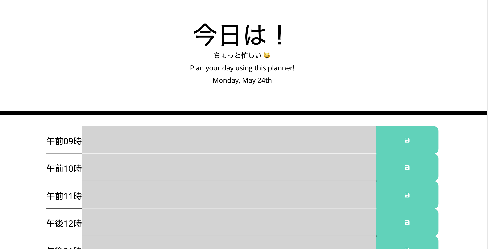

# 05_homework_planner

This homework was to create a planner using third-party APIs that logs input from the user and is saved to local storage. 

  This application started with beginner code in HTML and CSS. * The functionality was guided by a solved solution that was provided on accident *  
  By studying the JS provided, I was able to better understand the functionality of the color-coded display, which was the most confusing part of this exercise  

  I also could not figure out how to center the notification that showed when something was saved to local storage  

  A link to the website: https://jminaga.github.io/05_homework_planner/index.html  

  Shown below is an image of the finished product  

